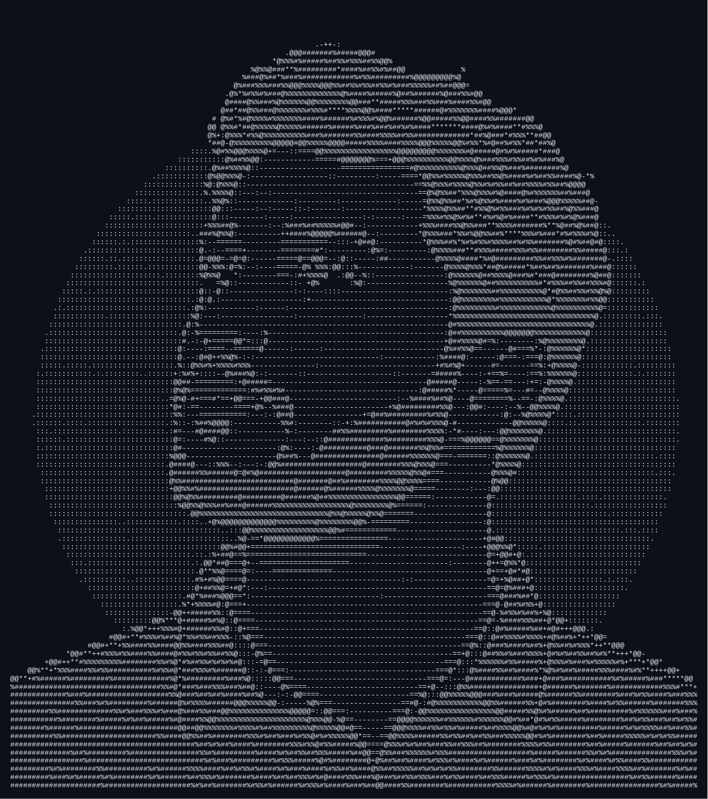

<table border="0" width="100%">
  <tr>
    <td width="35%" valign="top" align="center">
      <!-- LEFT COLUMN: Terminal Avatar -->
      
                     
</td>
    <td width="5%" valign="top">
      <!-- EMPTY SPACING COLUMN -->
    </td>
    <td width="60%" valign="top">
      <!-- RIGHT COLUMN: Details -->
      <h2>💫 About Me:</h2>
      
Hi 👋, I'm <strong>Yadhu Gopakumar</strong>, a Passionate Django Fullstack Developer from India.

      
🔭 I’m actively working on <strong>Full Stack Development</strong>.

      
📫 How to reach me: <strong>yadhugopakumar128@gmail.com</strong>

      
      <h3>📜 Resume</h3>
      
<a href="https://drive.google.com/file/d/19qGotTAFtmGj50FzhEQ9qZXuWEPib5mv/view?usp=drive_link" target="_blank">[DOWNLOAD RESUME]</a>

      <h3>🌐 Socials:</h3>
      

        
        
        
      

    </td>
  </tr>
</table>
